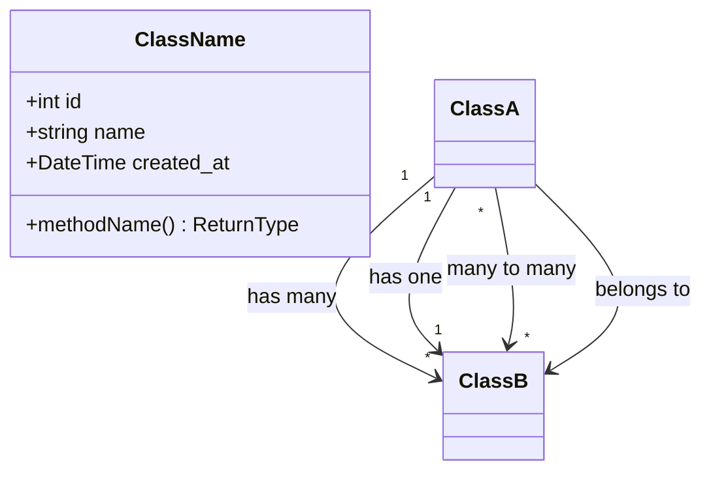
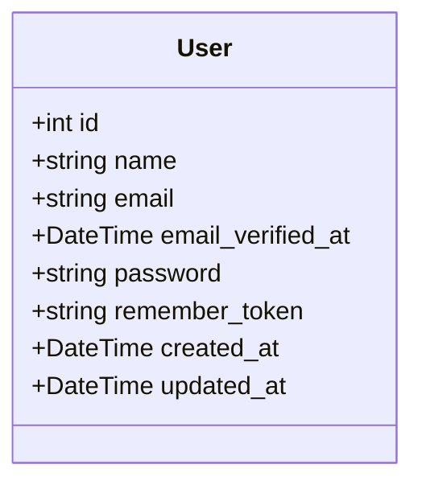
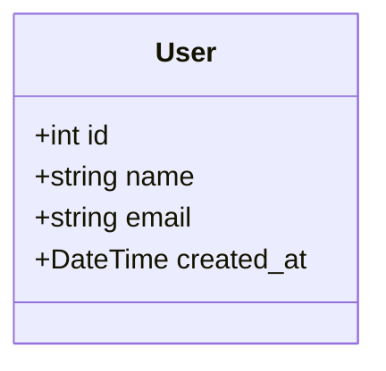

# Class Diagram

## Overview

Mermaid class diagrams for Laravel models and their relationships.

## Diagram Syntax Reference

## Relationship Notation

| Notation | Meaning |
|----------|---------|
| `"1" --> "*"` | One-to-Many |
| `"1" --> "1"` | One-to-One |
| `"*" --> "*"` | Many-to-Many |
| `-->` | Association/Belongs To |
| `<\|--` | Inheritance |

## Base User Model

## Project-Specific Class Diagram

<!-- AGENT: Replace this section with actual class diagram -->

## Model List
- [ ] List all models with their attributes
- [ ] Define relationships between models
