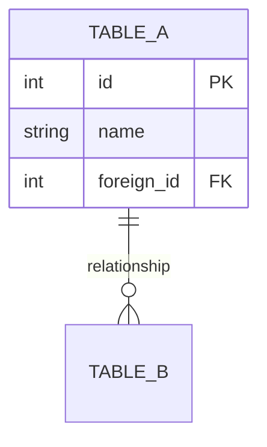
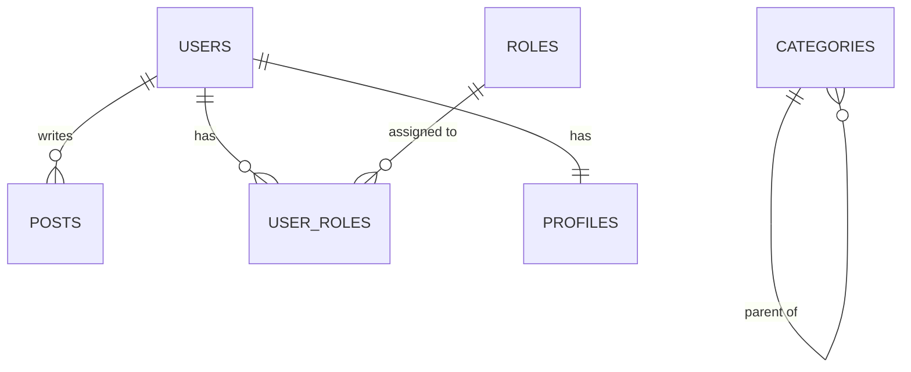
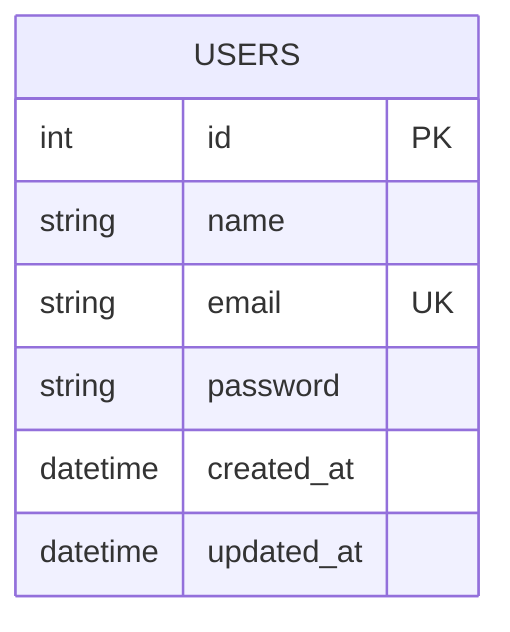
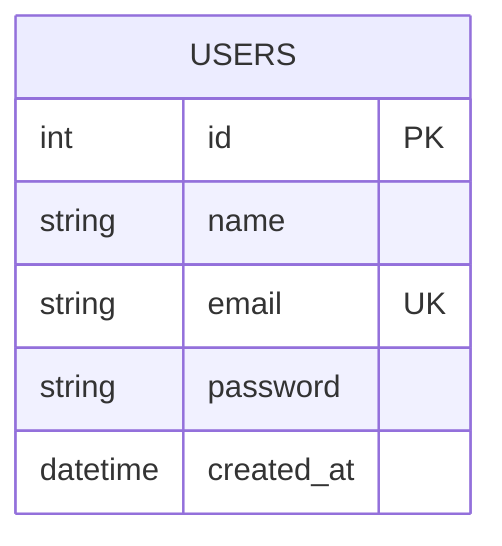

# Entity Relationship Diagram

## Overview

Mermaid ERD showing database table relationships.

## ERD Syntax Reference

## Relationship Notation

| Symbol | Meaning |
|--------|---------|
| `\|\|` | Exactly one |
| `o\|` | Zero or one |
| `}o` | Zero or many |
| `}\|` | One or many |
| `--` | Identifying relationship |
| `..` | Non-identifying relationship |

## Common Patterns

## Base Schema

## Project-Specific ERD

<!-- AGENT: Replace this section with actual ERD -->

## Tables List
- [ ] List all tables with columns
- [ ] Define all relationships
