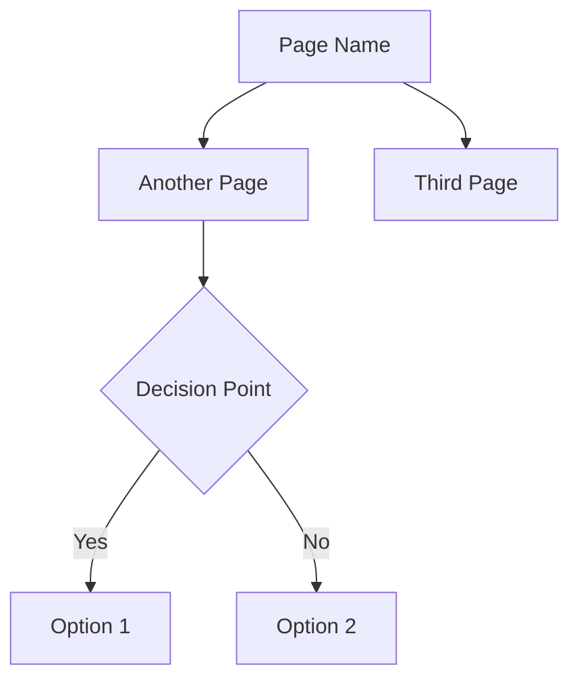
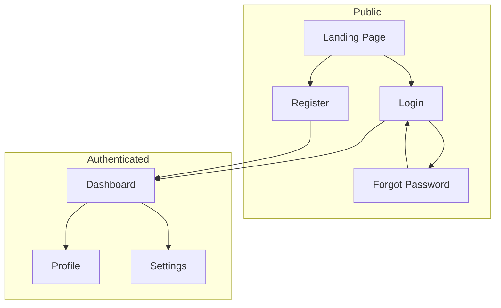
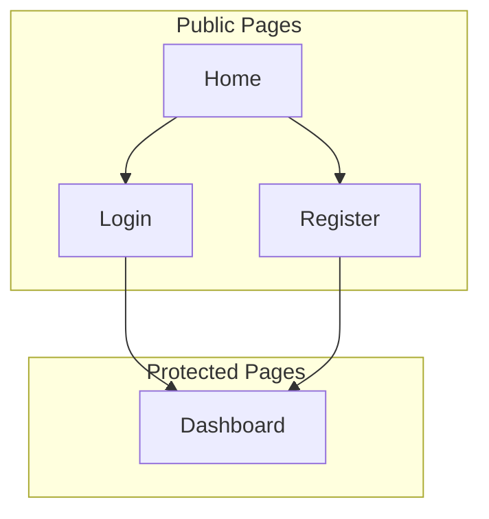

# Pages Flow (Sitemap)

## Overview

Mermaid flowchart showing all pages and navigation paths in the application.

## Flowchart Syntax Reference



## Node Shapes

| Shape | Syntax | Usage |
|-------|--------|-------|
| Rectangle | `[Text]` | Regular pages |
| Rounded | `(Text)` | Entry/exit points |
| Diamond | `{Text}` | Decision points |
| Circle | `((Text))` | Connection points |
| Stadium | `([Text])` | Start/end |

## Common SPA Structure



## Vue Router Structure

```typescript
// src/plugins/router.ts
const routes = [
  // Public routes
  { path: '/', name: 'landing', component: () => import('@/pages/Landing.vue') },
  { path: '/login', name: 'login', component: () => import('@/pages/Login.vue') },
  { path: '/register', name: 'register', component: () => import('@/pages/Register.vue') },
  
  // Protected routes
  {
    path: '/app',
    component: () => import('@/layouts/AppLayout.vue'),
    meta: { requiresAuth: true },
    children: [
      { path: '', name: 'dashboard', component: () => import('@/pages/Dashboard.vue') },
      { path: 'profile', name: 'profile', component: () => import('@/pages/Profile.vue') },
      { path: 'settings', name: 'settings', component: () => import('@/pages/Settings.vue') },
    ],
  },
]
```

## Project-Specific Pages Flow

<!-- AGENT: Replace this section with actual pages flow -->



## Pages List
- [ ] List all public pages
- [ ] List all protected pages
- [ ] Define navigation paths
- [ ] Identify route guards needed
