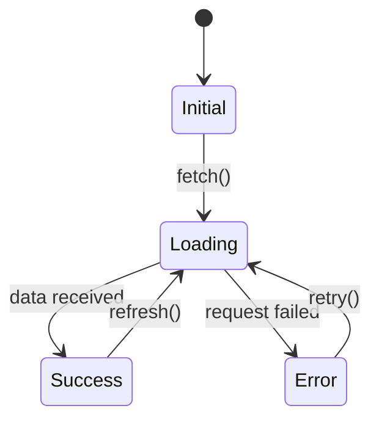
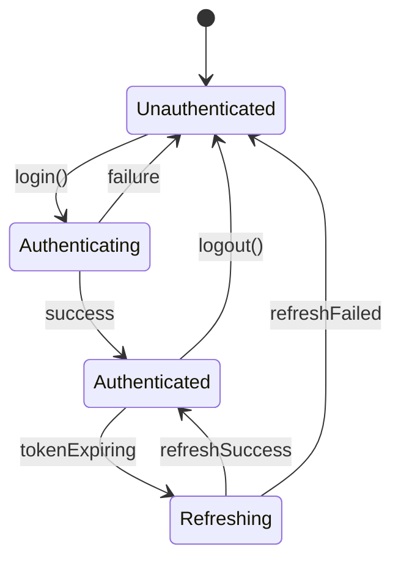
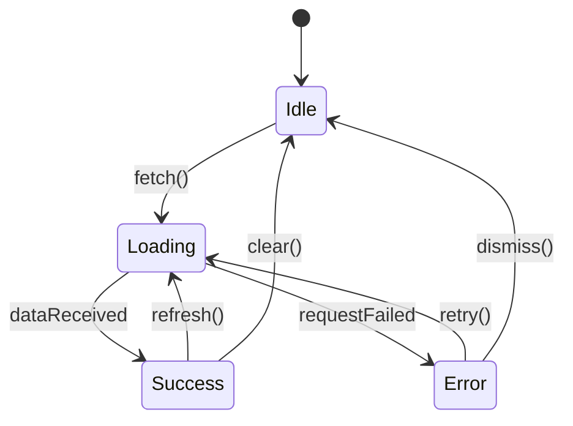
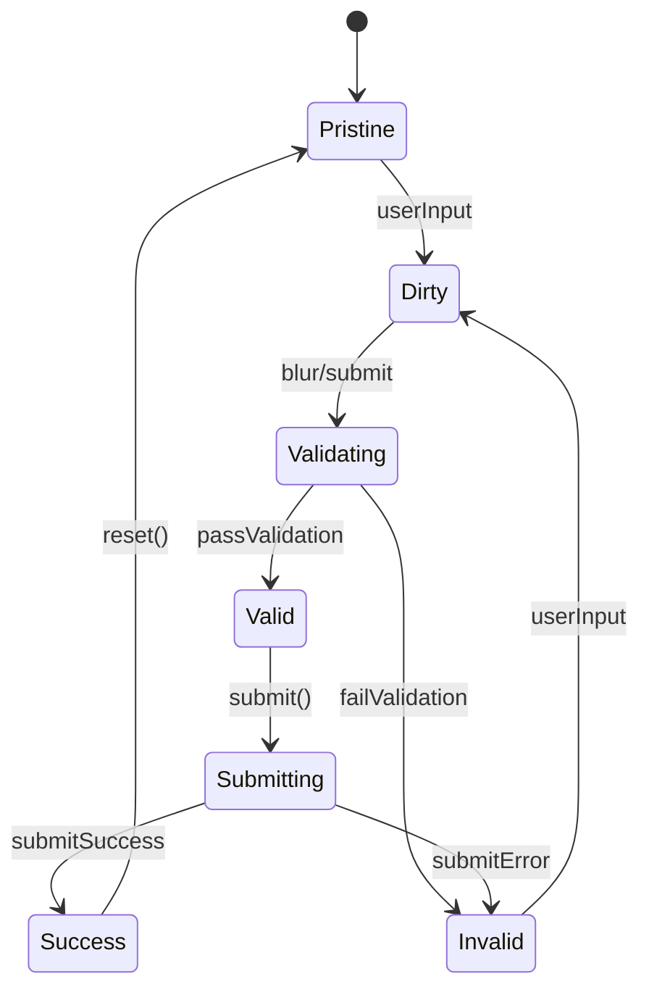
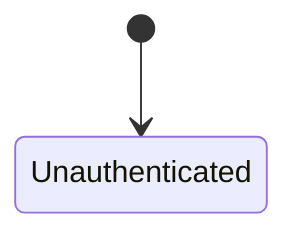
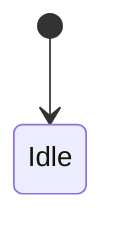

# State Flow

## Overview

Mermaid state diagrams for Pinia store state management.

## State Diagram Syntax Reference



## Common State Patterns

### Authentication State



### Data Fetching State



### Form State



## Pinia Store Implementation

```typescript
// stores/auth.ts
import { defineStore } from 'pinia'
import { ref, computed } from 'vue'

type AuthState = 'unauthenticated' | 'authenticating' | 'authenticated' | 'refreshing'

export const useAuthStore = defineStore('auth', () => {
  const state = ref<AuthState>('unauthenticated')
  const user = ref<User | null>(null)
  const error = ref<string | null>(null)

  const isAuthenticated = computed(() => state.value === 'authenticated')
  const isLoading = computed(() => 
    state.value === 'authenticating' || state.value === 'refreshing'
  )

  async function login(credentials: Credentials) {
    state.value = 'authenticating'
    error.value = null
    try {
      user.value = await api.login(credentials)
      state.value = 'authenticated'
    } catch (e) {
      error.value = e.message
      state.value = 'unauthenticated'
    }
  }

  function logout() {
    user.value = null
    state.value = 'unauthenticated'
  }

  return { state, user, error, isAuthenticated, isLoading, login, logout }
})
```

## Project-Specific State Flows

<!-- AGENT: Replace this section with actual state flows -->

### Authentication Store



### Feature Store(s)



## Stores List
- [ ] List all Pinia stores
- [ ] Define state transitions for each
- [ ] Identify shared state between stores
